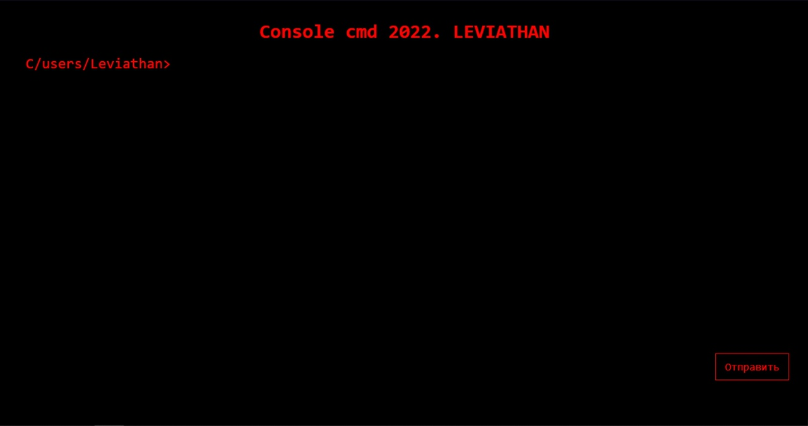
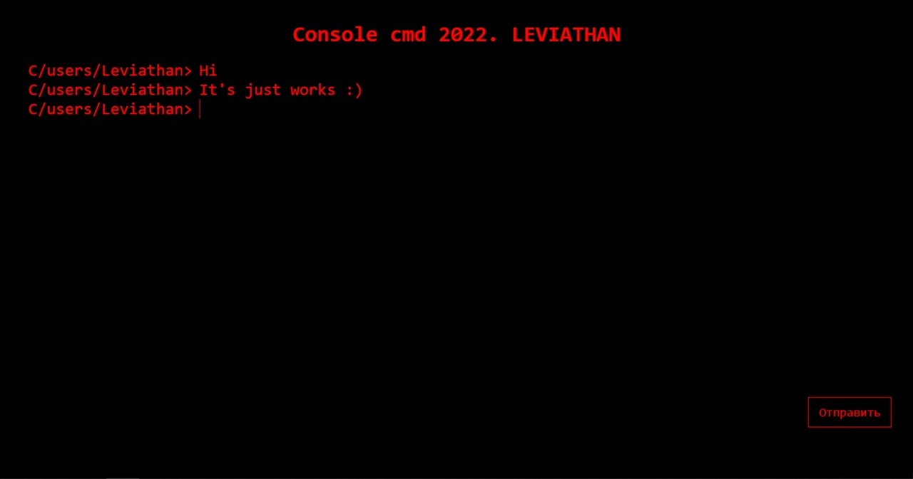
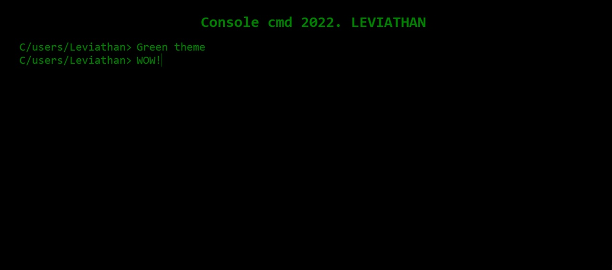

# Test project to practice working with styled components

---

### Simple console simulation

* Made by styled-components
* Changing themes
* That's it, did you expect anything else? :)

---
## Screenshots

---

## Usage

* You must have [Node.js](https://nodejs.org/en/) installed.
* Write in the terminal ``npm i``, then ``npm start``.